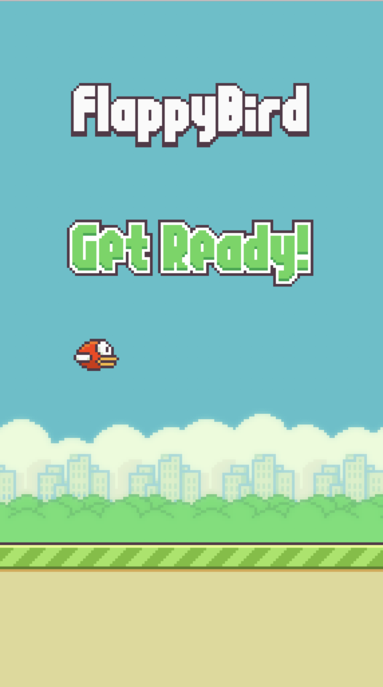

### Flappy Mouth - Making Waves

Written by Dmitriy Semashkov and Bjørnar Moe Remmen as a project used for meetups with students. 

This code makes it possible to play flappy bird using your mouth utilizing the web cam.

From this start screen, open your mouth 3 times to start playing.

Here a losing screen. To get back to starting screen, open your mouth 2 times.

# Installation instructions

(only tested on osx and python3) 

    brew install cmake
    

install python dependencies 

    pip3 install -r requirements.txt
    
    
run game with **flappy.py**

    python3 flappy.py

Rewritten version of https://github.com/sourabhv/FlapPyBird with added functionality to detect face.

